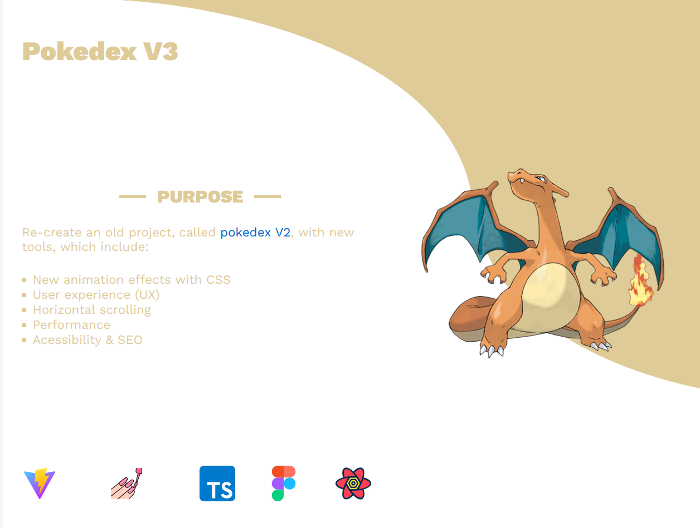
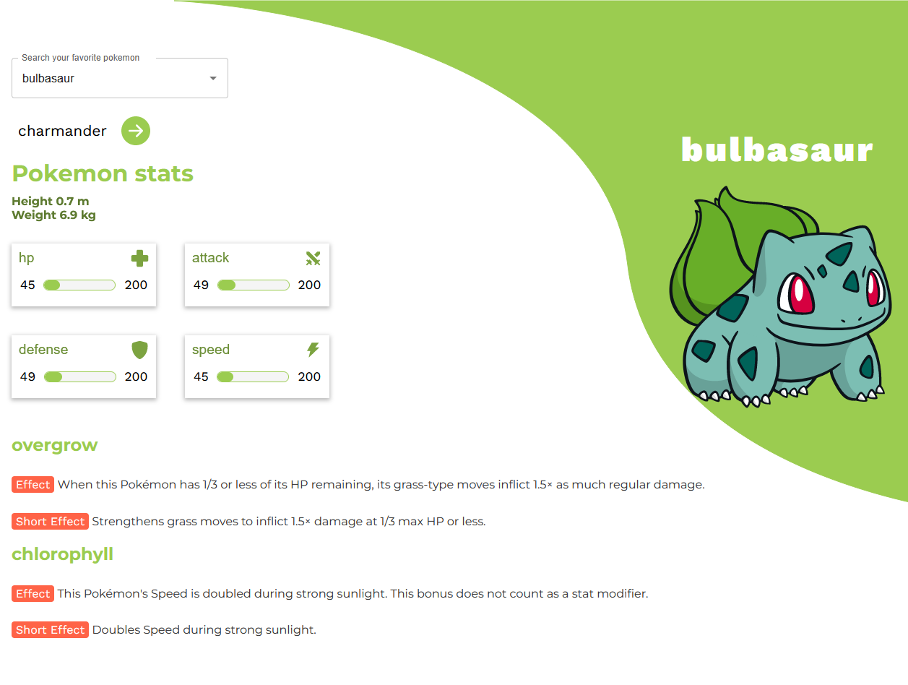
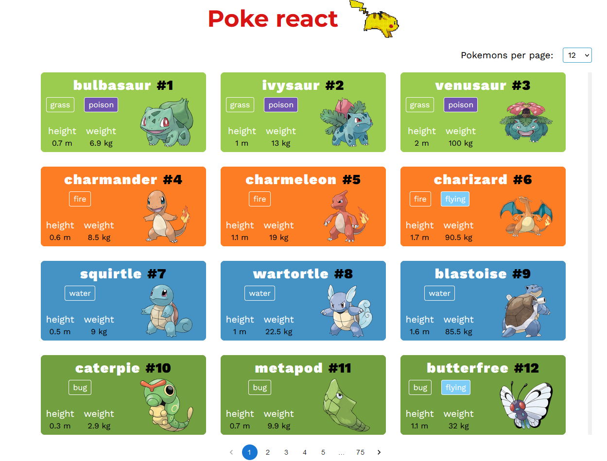
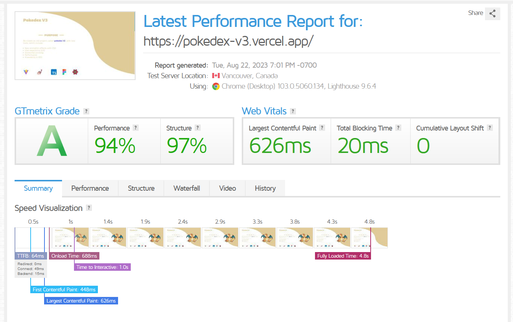

    <h1 align='center'>Pokedex</h1>
     

  
This project was created with React, typescript and vite js

 

  
If you want to see the website, 
    <a href='https://pokedex-v3.vercel.app/' target='_blank'>click here</a>
  

